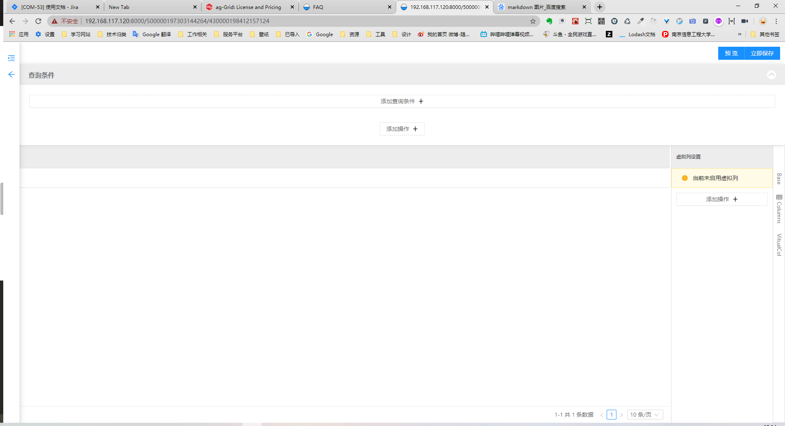

# micro-page

一个可视化配置页面丶预览页面丶运行页面的库

功能特性

- 可视化配置页面
- 按配置驱动页面

## Getting Started

- 安装依赖 `npm i -S micro-page-core micro-page-react micro-page-plugin-preset`

## 在 react 中使用

```tsx
import MicroPageCore from 'micro-page-core';
import MicroPageReact from 'micro-page-react';
import { List, BaseForm } from 'micro-page-plugin-preset';


const core = new MicroPageCore({
  templates: [
    // 声明模版
    {
      key: 'list',
      name: '列表页',
      cover: listCover,
      plugin: new List({}),
    },
    {
      key: 'baseForm',
      name: '基本表单',
      plugin: new BaseForm({}),
    },
    {
      key: '其他模版key',
      name: '模版名',
      plugin: new 你的模版插件({...}),
    },...
  ],
  service: {
    ...,// 需要实现的接口配置
  },
  request: Axios实例
});

// 嵌入工作台,随便放在你的页面某处
const Workbench : React.FC<any> =  () => {
  return <MicroPageReact.Render core={core} />;
};

```

> 上述配置后即可运行你的 react 项目即可使用可视化配置
> 如果在运行配置好的页面,如下

```ts
// 按项目嵌入
const Project: React.FC<any> = () => {
  return <MicroPageReact.Project core={core} id="项目 id" />;
};
// 按页面嵌入
const Page: React.FC<any> = () => {
  return <MicroPageReact.Page core={core} id="页面 id" projectId="项目 id" />;
};
```

## 页面操作流程

1. 创建一个项目
   
2. 针对项目设置字段
   
   
3. 按模版创建页面
   
   
4. 配置项目下的页面
   
5. 如果是按项目嵌入还需要设置路由处理(暂未实现)
6. 在嵌入处运行使用配置好的项目/页面(开发人员提前做好嵌入处理)

## todo

- [x] 可视化配置与预览(工作台)
  - [x] 预置插件
  - [x] 预览
- [x] 嵌入使用
  - [ ] 项目嵌入
  - [x] 页面嵌入

# micro-page-core

核心模块,处理初始化工作,集成配置

# micro-page-react

根据`core`渲染出 react 框架下的 工作台、项目、页面

# micro-page-plugin-preset

一些做好的预置 plugin

# 结构图

```
+------------------+                     +------------------+
|                  |                     |                  |
|                  |                     |                  |
|                  |                     |                  |
|      plugin1     +--------------------->                  |                               +-------------------+
|                  |                     |                  |                               |                   |
|                  |                     |                  |                               |                   |
|                  |                     |                  |                               |                   |
+------------------+                     |                  |                               |                   |
                                         |                  +------------------------------->       render      |
                                         |                  |                               |                   |
                                         |       core       |                               |                   |
+------------------+                     |                  |                               |                   |
|                  +--------------------->                  |  +----------------------------+                   |
|                  |                     |                  |  |                            +---------+---------+
|                  |                     |                  |  |                                      |
|                  |                     |                  |  |                                      |
|     plugin2      |                     |                  |  |                                      |
|                  |                     |                  |  |                                      |
|                  |                     |                  |  |                                      |
|                  |                     |                  |  |                                      |
+------------------+                     +------------------+  |                            +---------v----------+
                                                               |                            |                    |
      ......                                                   |                            |                    |
                                                               |                            |                    |
                                                               |                            |                    |
                                                               |                            |   settings page    |
                           +-----------------------------------v+                           |                    |
                           |                                    |                           |                    |
                           |                                    |                           |                    |
                           |                                    |                           |                    |
                           |                                    |                           +-----------X--------+
                           |                                    |                                      XX
                           |                                    |                                     XX
                           |                                    |           +----------------+       XX
                           |            target page             |           |                |     XX
                           |                                    |           |                |  XXX
                           |                                    |           |                |XXX
                           |                                    <-----------+ config storage |
                           |                                    |           |                |
                           |                                    |           |                |
                           |                                    |           |                |
                           |                                    |           +----------------+
                           +------------------------------------+

```

# 其他文档

- [开发文档](./docs/开发文档.md)
- [扩展文档](./docs/扩展文档.md)
- [设计文档](./docs/设计文档.md)

# FAQ

## 什么是按项目嵌入

`按项目嵌入`就是把整个项目所有页面一起嵌入到你的具体业务中的某处
项目嵌入根据路由配置处理好路由加载
`按项目嵌入`只需要在一处嵌入就可以使用该项目下的所有页面交互

## 什么是按页面嵌入

`按页面嵌入`可以把某个项目下的某个页面嵌入到你的具体业务中的某处
具体的路由是由你的具体业务自己定义的

## 接口加上下文参数如何处理呢

```ts
import { ServiceContext } from 'micro-page-react';
```

利用 react context `ServiceContext` 注入上下文,同时 sevice 保证不是 bind this function,ServiceContext 会替换 server function 的 this
